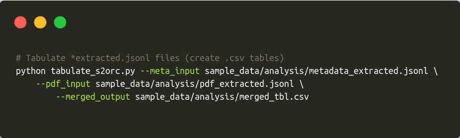

```{r setup, include=FALSE}
knitr::opts_chunk$set(echo = FALSE,
                      out.width = "80%")
```

```{r out.width="100%"}

```

<!-- badges: start -->


[](https://zenodo.org/badge/latestdoi/330344430)
<!-- badges: end -->

### Synopsis

Mud volcanoes represent geological structures, which host various 
hydrocarbonoclastic microbial consortia. Even though mud volcanoes can provide
valuable data regarding hydrocarbon oxidation, topic is [still off
the radar](https://pubmed.ncbi.nlm.nih.gov/?term=mud%5BTIAB%5D+AND+volcano%5BTIAB%5D).
Meanwhile, NLP has been gaining traction over the last years in the mainstream
fields [@wang-2020]. Niche environmental topics lamentably lag behind.

We present a mining pipeline - **muddy_mine**, which could engage NLP technology in the niche
environmental topics such as mud volcanoes. This pipeline is able to mine taxonomy
(bacterial, archaeal), methods or any other tokens of interest from the Open Access articles.
Articles available in the [S2ORC](https://github.com/allenai/s2orc/)
database, [CC BY-NC 2.0, unmodified](https://creativecommons.org/licenses/by-nc/2.0/)
[@lo-wang-2020-s2orc]. **muddy_mine** output represents a `csv` table with all the relevant
data regarding mud volcanoes. 

**muddy_mine** was used to create [**muddy_db**](https://github.com/TracyRage/muddy_db).
**muddy_db** being the first biologically-oriented mud volcano database.

Check muddy_db web app: [**muddy_db**](https://muddy-db.shinyapps.io/muddy/)

### Methods

In order to aggregate biologically-oriented tokens, we used
[ScispaCy](https://github.com/allenai/scispacy) [@neumann_2019_scispacy] models.
Taxonomy-flavored tokens were checked against 
[NCBI Taxonomy](ftp://ftp.ncbi.nlm.nih.gov/pub/taxonomy/) database (Nov, 2020) [@schoch-2020] . We built a local NCBI database with [ETE3](https://github.com/etetoolkit/ete) [@cepas_2016].

### Set up environment

* Download repository

`git clone https://github.com/TracyRage/muddy_mine.git && cd muddy_mine`

* Install [miniconda](https://docs.conda.io/en/latest/miniconda.html) and [bioconda](https://bioconda.github.io/user/install.html) (optional) 

* Initialize conda environment

`conda env create --file environment.yml`

* Activate conda environment

`conda activate muddy_db`

* Install ScispaCy model `en_core_sci_sm`

`pip install https://s3-us-west-2.amazonaws.com/ai2-s2-scispacy/releases/v0.3.0/en_core_sci_sm-0.3.0.tar.gz`

* Install NCBI Taxonomy database

`python -c 'from ete3 import NCBITaxa; ncbi = NCBITaxa(); ncbi.update_taxonomy_database()'`
 
 If you get an error, [click here](https://github.com/Prunoideae/MitoFlex/issues/2#issuecomment-682018016).

> Nota bene

S2ORC database includes around 12M papers. The full database has around 200GB (compressed).
In order to avoid wrangling this heavy dataset, we created a subset of S2ORC data. You can find it in the `sample_data/` directory. Pipeline demo works with that very subset.

If you need help, `python any_muddy_script.py --help`

### Pipeline

1. Extract meta entries from the S2ORC (`scan_s2orc_meta.py`)

If you want to get articles from the S2ORC, then you need to have their metadata, be it 
PMIDs (Pubmed IDs) or DOIs. **muddy_mine** uses PMIDs to retrieve metadata from the S2ORC.

`scan_s2orc_meta.py` does the following procedures: (1) takes your Pubmed query
(`--entrez-query`); (2) gets the correspondent PMIDs from the Pubmed; 
(3) decompresses S2ORC archives (`--archives_path`); (4) compares your list of PMIDs against S2ORC metadata; (5) writes the matching hits to an output file (`--output_file`).

```{r}
knitr::include_graphics("man/figures/scan_s2orc_meta.png")
```

2. Extract pdf entries from S2ORC

When you have metadata entries, you can proceed to extract the articles. 

 `scan_s2orc_pdf.py` does the following procedures: (1) uses the previous
step output file (`--metadata_input`); (2) checks it against the S2ORC pdf_parse database
(`--pdf_archives`); (3) writes the matching hits to an output file (`--output_file`).

```{r}
knitr::include_graphics("man/figures/scan_s2orc_pdf.png")
```

3. Extract fields of interest from the `jsonl` files (`extract_s2orc.py`)

Outputs from the previous steps represent `jsonl` files. Those `json` files contain a lot of
metadata fields, ranging from PMIDs to arxiv_ids. We need to extract the *important ones*.

`extract_s2orc.py` does the following procedures: (1) takes metadata (`--metadata_input`) and
pdf_parse (`--pdf_input`) output files from the previous step and (2) creates files with
essential fields (pmid, title, authors, abstract etc.) (`--meta_output` and `--pdf_output`).

```{r}
knitr::include_graphics("man/figures/extract_s2orc.png")
```

4. Tabulate `jsonl` files (`tabulate_s2orc.py`)

When you have clean metadata and pdf_parse `jsonl` files, you can merge them and get
a `csv` table. Use output files from the previous step (`--meta_input`, `--pdf_input`).

```{r}

```

5. Mine data (`mine_data.py`)

When you have the `csv` table, you can mine all the relevant mud volcano data.
Check `module/get_terms.py` and `module/get_dict_terms.py` for more information. 

`mine_data.py` does the following procedures: (1) parses articles (`--input_table`);
(2) mines and counts taxonomic-flavored tokens; (3) mines and counts chemical, geological and other tokens of
interest; (3) writes results to `csv` tables (`--output_mv` and `--output_taxa`).

> Nota bene

Mining process takes a lot of time. Check the mining results in the `sample_data/mining_results/` directory.

```{r}
knitr::include_graphics("man/figures/mine_data.png")
```


### References