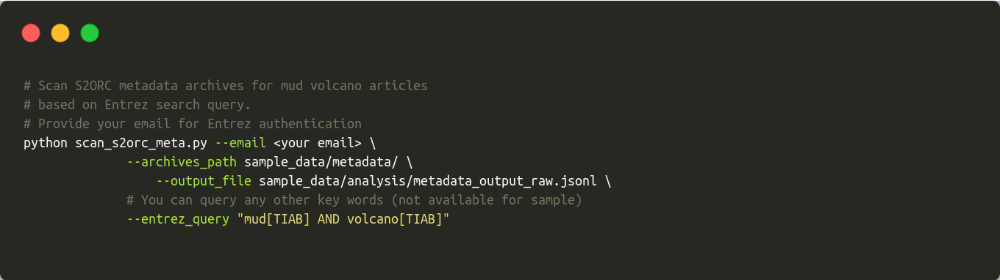
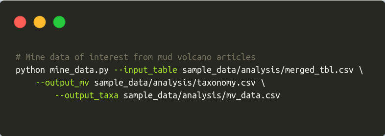

muddy\_mine
================

<!-- badges: start -->

<!-- badges: end -->

#### Synopsis

Mud volcanoes represent geological structures, which host various
hydrocarbonoclastic microbial consortia. Even though mud volcanoes can
provide valuable data regarding recalcitrant hydrocarbon oxidation,
topic is [still off the
radar](https://pubmed.ncbi.nlm.nih.gov/?term=mud%5BTIAB%5D+AND+volcano%5BTIAB%5D).
Meanwhile, NLP technology has been gaining traction over the last years
in the mainstream fields (Wang et al. 2020). Niche environmental topics
lamentably lag behind.

We present a mining pipeline - **muddy\_mine**, which could engage NLP
technology in the niche environmental topics such as mud volcanoes. This
pipeline is able to mine taxonomy (bacterial, archaeal), methods or any
other tokens of interest from the Open Access articles. Articles
available in the [S2ORC](https://github.com/allenai/s2orc/) database,
[CC BY-NC 2.0,
unmodified](https://creativecommons.org/licenses/by-nc/2.0/) by (Lo et
al. 2020). **muddy\_mine** output represents a csv table with all the
relevant data regarding mud volcanoes.

#### Methods

In order to aggregate biologically-oriented tokens, we used
[ScispaCy](https://github.com/allenai/scispacy) (Neumann et al. 2019)
models. Taxonomy-flavored tokens were checked against [NCBI
Taxonomy](ftp://ftp.ncbi.nlm.nih.gov/pub/taxonomy/) database (Nov,
2020). We built local NCBI database with
[ETE3](https://github.com/etetoolkit/ete) (Huerta-Cepas, Serra, and Bork
2016).

#### Bonus

Pipeline is flexible and can be adapted for any topics. As long as you
provide a script with python dataclasses including your terminology of
interest.

#### Set up environment

Download repository

`git clone https://github.com/TracyRage/muddy_mine.git`

Initialize conda environment

`conda env create --file muddy_conda.txt`

Install NCBI Taxonomy database

`python -c 'from ete3 import NCBITaxa; ncbi = NCBITaxa();
ncbi.update_taxonomy_database()`

> Note bene

S2ORC database includes around 12M papers. The full database has around
200GB (compressed). In order to avoid wrangling this heavy dataset, we
created a subset of S2ORC data. You can find it in the `sample_data/`
directory. Pipeline demo works with that very subset.

If you need help, `python any_muddy_script.py --help`

#### Pipeline

1.  Extract meta entries from S2ORC

2.  Extract pdf entries from S2ORC

3.  Extract fields of interest from jsonl files

4.  Tabulate jsonl files

5.  Mine data

#### References

Huerta-Cepas, Jaime, François Serra, and Peer Bork. 2016. “ETE 3:
Reconstruction, Analysis, and Visualization of Phylogenomic Data.”
*Molecular Biology and Evolution* 33 (6): 1635–8.
<https://doi.org/10.1093/molbev/msw046>.

Lo, Kyle, Lucy Lu Wang, Mark Neumann, Rodney Kinney, and Daniel Weld.
2020. “S2ORC: The Semantic Scholar Open Research Corpus.” In
*Proceedings of the 58th Annual Meeting of the Association for
Computational Linguistics*, 4969–83. Online: Association for
Computational Linguistics.
<https://doi.org/10.18653/v1/2020.acl-main.447>.

Neumann, Mark, Daniel King, Iz Beltagy, and Waleed Ammar. 2019.
“ScispaCy: Fast and Robust Models for Biomedical Natural Language
Processing.” In *Proceedings of the 18th Bionlp Workshop and Shared
Task*, 319–27. Florence, Italy: Association for Computational
Linguistics. <https://doi.org/10.18653/v1/W19-5034>.

Wang, J., H. Deng, B. Liu, A. Hu, J. Liang, L. Fan, X. Zheng, T. Wang,
and J. Lei. 2020. “Systematic Evaluation of Research Progress on Natural
Language Processing in Medicine Over the Past 20 Years: Bibliometric
Study on PubMed.” *J Med Internet Res* 22 (1): e16816.

