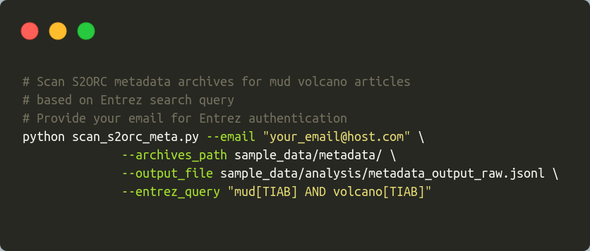
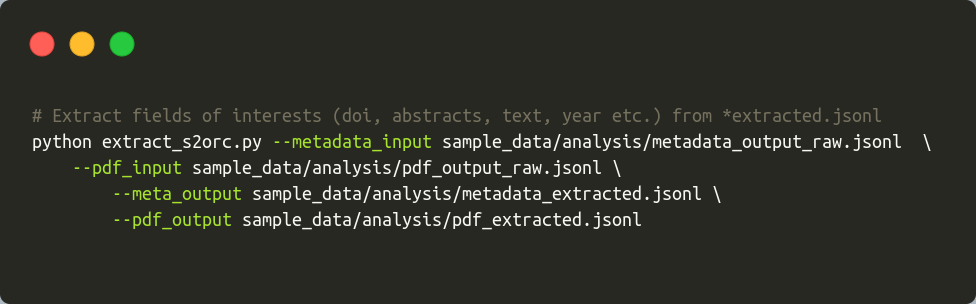
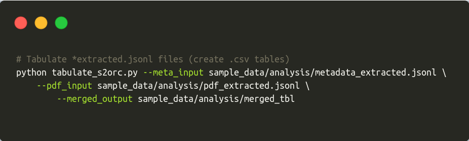
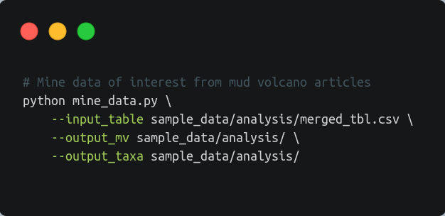

muddy\_mine
================

<!-- badges: start -->

<!-- badges: end -->

### Synopsis

Mud volcanoes represent geological structures, which host various
hydrocarbonoclastic microbial consortia. Even though mud volcanoes can
provide valuable data regarding hydrocarbon oxidation, topic is [still
off the
radar](https://pubmed.ncbi.nlm.nih.gov/?term=mud%5BTIAB%5D+AND+volcano%5BTIAB%5D).
Meanwhile, NLP has been gaining traction over the last years in the
mainstream fields (Wang et al. 2020). Niche environmental topics
lamentably lag behind.

We present a mining pipeline - **muddy\_mine**, which could engage NLP
technology in the niche environmental topics such as mud volcanoes. This
pipeline is able to mine taxonomy (bacterial, archaeal), methods or any
other tokens of interest from the Open Access articles. Articles
available in the [S2ORC](https://github.com/allenai/s2orc/) database,
[CC BY-NC 2.0,
unmodified](https://creativecommons.org/licenses/by-nc/2.0/) (Lo et al.
2020). **muddy\_mine** output represents a `csv` table with all the
relevant data regarding mud volcanoes.

**muddy\_mine** was used to create
[**muddy\_db**](https://github.com/TracyRage/muddy_db). **muddy\_db**
being the first biologically-oriented mud volcano database.

Check muddy\_db web app:
[**muddy\_db**](https://muddy-db.shinyapps.io/muddy_db/)

### Methods

In order to aggregate biologically-oriented tokens, we used
[ScispaCy](https://github.com/allenai/scispacy) (Neumann et al. 2019)
models. Taxonomy-flavored tokens were checked against [NCBI
Taxonomy](ftp://ftp.ncbi.nlm.nih.gov/pub/taxonomy/) database (Nov, 2020)
(Schoch et al. 2020) . We built a local NCBI database with
[ETE3](https://github.com/etetoolkit/ete) (Huerta-Cepas, Serra, and Bork
2016).

### Set up environment

-   Download repository

`git clone https://github.com/TracyRage/muddy_mine.git && cd muddy_mine`

-   Install [miniconda](https://docs.conda.io/en/latest/miniconda.html)
    and [bioconda](https://bioconda.github.io/user/install.html)
    (optional)

-   Initialize conda environment

`conda env create --file environment.yml`

-   Activate conda environment

`conda activate muddy_db`

-   Install ScispaCy model `en_core_sci_sm`

`pip install https://s3-us-west-2.amazonaws.com/ai2-s2-scispacy/releases/v0.3.0/en_core_sci_sm-0.3.0.tar.gz`

-   Install NCBI Taxonomy database

`python -c 'from ete3 import NCBITaxa; ncbi = NCBITaxa(); ncbi.update_taxonomy_database()'`

If you get an error, [click
here](https://github.com/Prunoideae/MitoFlex/issues/2#issuecomment-682018016).

> Nota bene

S2ORC database includes around 12M papers. The full database has around
200GB (compressed). In order to avoid wrangling this heavy dataset, we
created a subset of S2ORC data. You can find it in the `sample_data/`
directory. Pipeline demo works with that very subset.

If you need help, `python any_muddy_script.py --help`

### Pipeline

1.  Extract meta entries from the S2ORC (`scan_s2orc_meta.py`)

If you want to get articles from the S2ORC, then you need to have their
metadata, be it PMIDs (Pubmed IDs) or DOIs. **muddy\_mine** uses PMIDs
to retrieve metadata from the S2ORC.

`scan_s2orc_meta.py` does the following procedures: (1) takes your
Pubmed query (`--entrez-query`); (2) gets the correspondent PMIDs from
the Pubmed; (3) decompresses S2ORC archives (`--archives_path`); (4)
compares your list of PMIDs against S2ORC metadata; (5) writes the
matching hits to an output file (`--output_file`).

2.  Extract pdf entries from S2ORC

When you have metadata entries, you can proceed to extract the articles.

`scan_s2orc_pdf.py` does the following procedures: (1) uses the previous
step output file (`--metadata_input`); (2) checks it against the S2ORC
pdf\_parse database (`--pdf_archives`); (3) writes the matching hits to
an output file (`--output_file`).

3.  Extract fields of interest from the `jsonl` files
    (`extract_s2orc.py`)

Outputs from the previous steps represent `jsonl` files. Those `json`
files contain a lot of metadata fields, ranging from PMIDs to
arxiv\_ids. We need to extract the *important ones*.

`extract_s2orc.py` does the following procedures: (1) takes metadata
(`--metadata_input`) and pdf\_parse (`--pdf_input`) output files from
the previous step and (2) creates files with essential fields (pmid,
title, authors, abstract etc.) (`--meta_output` and `--pdf_output`).

4.  Tabulate `jsonl` files (`tabulate_s2orc.py`)

When you have clean metadata and pdf\_parse `jsonl` files, you can merge
them and get a `csv` table. Use output files from the previous step
(`--meta_input`, `--pdf_input`).

5.  Mine data (`mine_data.py`)

When you have the `csv` table, you can mine all the relevant mud volcano
data. Check `module/get_terms.py` and `module/get_dict_terms.py` for
more information.

`mine_data.py` does the following procedures: (1) parses articles
(`--input_table`); (2) mines and counts taxonomic-flavored tokens; (3)
mines and counts chemical, geological and other tokens of interest; (3)
writes results to `csv` tables (`--output_mv` and `--output_taxa`).

> Nota bene

Mining process takes a lot of time. Check the mining results in the
`sample_data/mining_results/` directory.

### References

Huerta-Cepas, Jaime, François Serra, and Peer Bork. 2016. “ETE 3: Reconstruction, Analysis, and Visualization of
Phylogenomic Data.” *Molecular Biology and Evolution* 33 (6):
1635–38. <https://doi.org/10.1093/molbev/msw046>.

Lo, Kyle, Lucy Lu Wang, Mark Neumann, Rodney Kinney, and Daniel Weld.
2020. “S2ORC: The Semantic Scholar Open Research Corpus.” In
*Proceedings of the 58th Annual Meeting of the Association for
Computational Linguistics*, 4969–83. Online: Association for
Computational Linguistics.
<https://doi.org/10.18653/v1/2020.acl-main.447>.

Neumann, Mark, Daniel King, Iz Beltagy, and Waleed Ammar. 2019.
“ScispaCy: Fast and Robust Models for Biomedical Natural Language
Processing.” In *Proceedings of the 18th BioNLP Workshop and Shared
Task*, 319–27. Florence, Italy: Association for Computational
Linguistics. <https://doi.org/10.18653/v1/W19-5034>.

Schoch, C. L., S. Ciufo, M. Domrachev, C. L. Hotton, S. Kannan, R.
Khovanskaya, D. Leipe, et al. 2020. “NCBI Taxonomy:
a comprehensive update on curation, resources and tools.”
*Database (Oxford)* 2020 (January).

Wang, J., H. Deng, B. Liu, A. Hu, J. Liang, L. Fan, X. Zheng, T. Wang,
and J. Lei. 2020. “Systematic Evaluation of
Research Progress on Natural Language Processing in Medicine Over the
Past 20 Years: Bibliometric Study on PubMed.” *J Med Internet
Res* 22 (1): e16816.

